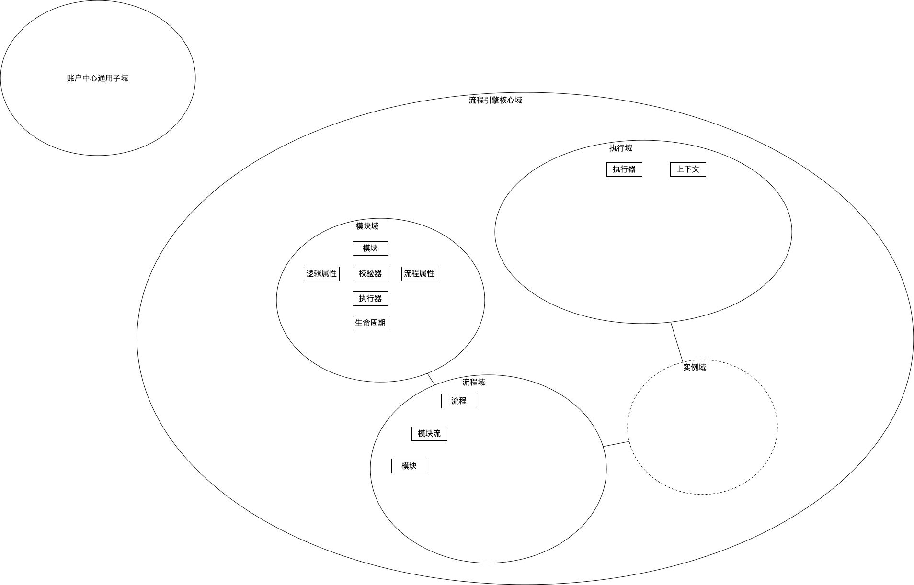

# nstop-engine简介
Nstop-engine意为永动机，期望他可以帮助公司业务/个人完成他们的目标/梦想。内嵌一款Java实现的轻量级流程引擎，在此基础上希望打造出几个产品（接口编排、逻辑编排、数据编排），这是一个开源项目，希望大家积极参与建设，去issue领取任务参与进来。

### 开源流程引擎对比

<table>
    <tr>
        <td></td>
        <td></td>
        <td>Activiti</td>
        <td>Camunda</td>
        <td>Compileflow</td>
        <td>Nstop-engine</td>
    </tr>
    <tr>
        <td></td>
        <td>核心表量</td>
        <td>28</td>
        <td>22</td>
        <td>0</td>
        <td>5</td>
    </tr>
    <tr>
        <td  rowspan = "3"> 特性 </td>
        <td>中断可重入</td>
        <td>√</td>
        <td>√</td>
        <td>×</td>
        <td>√</td>
    </tr>
    <tr>
        <td>支持回滚</td>
        <td>×</td>
        <td>√</td>
        <td>×</td>
        <td>√</td>
    </tr>
    <tr>
        <td>运行模式</td>
        <td>独立运行和内嵌</td>    
        <td>独立运行和内嵌</td>
        <td>内嵌</td>
        <td>内嵌</td>
    </tr>
    <tr>
        <td rowspan = "3">兼容性</td>
        <td>流程格式</td>
        <td>BPMN2.0、XPDL、PDL</td>
        <td>BPMN2.0、XPDL、PDL</td>
        <td>BPMN2.0</td>
        <td>BPMN2.0</td>
    </tr>
    <tr>
        <td>支持脚本</td>
        <td>JUEL、groovy</td>    
        <td>python、ruby、groovy、JUEL</td>
        <td>QlExpress</td>
        <td>groovy</td>
    </tr>
    <tr>
        <td>支持数据库</td>
        <td>Oracle、SQL Server、MySQL</td>    
        <td>Oracle、SQL Server、MySQL、postgre</td>
        <td>无</td>
        <td>MySQL</td>
    </tr>
</table>

## 领域设计

## 技术方案
[V0版本技术方案](readme/tech_plan_V0.md)