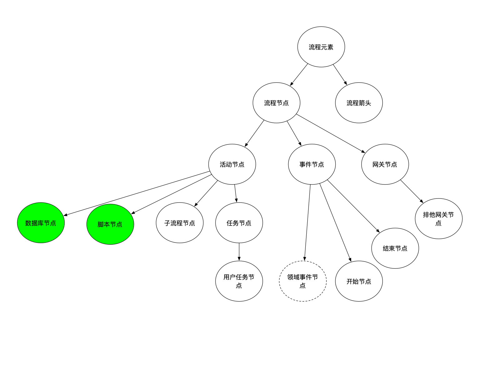

# nstop-engine
## 功能概要
要完成以下功能：
选择数据源->数据库->数据库表->增删改查->groovy脚本执行->结束
1. 数据库模块: 选择数据源/数据库
2. 数据库操作：组装sql执行，支持批量查询、新增、修改、删除。
3. 脚本执行：利用groovy，从上下文中读取变量，进行逻辑和数据处理，运行脚本，结果可以保存在上下文中。
4. 执行过程数据改造，不落库。

   
## 领域设计

### 领域模型

## 迭代计划
### 迭代目标
V0版本迭代中，有兴趣的朋友请前往Issue领取任务

### 迭代节奏
每双周周四晚上举行项目成员会议，会议内容：进度、技术方案设计、问题讨论、任务分配、脑爆、PullRequest(CR)

### 完善ing